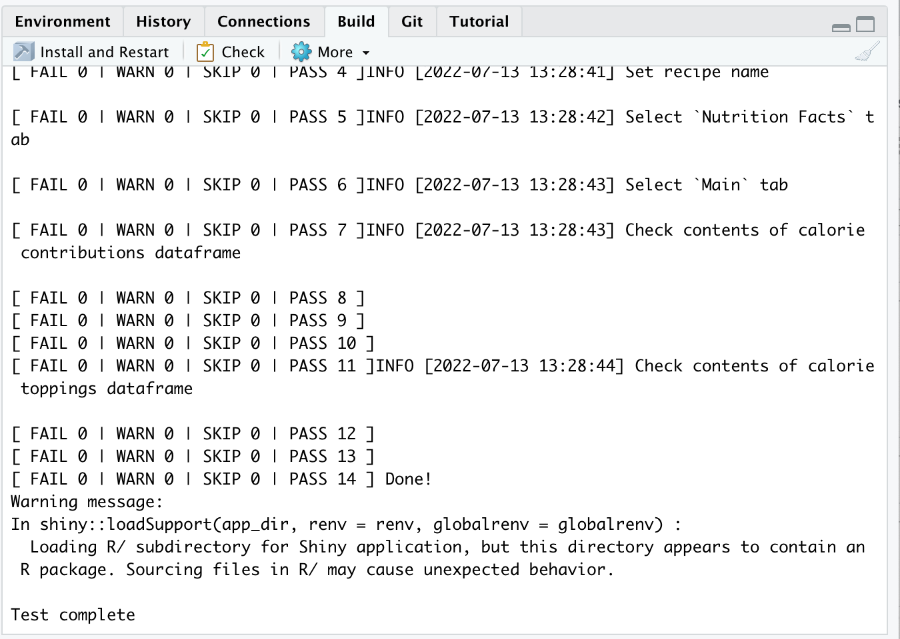
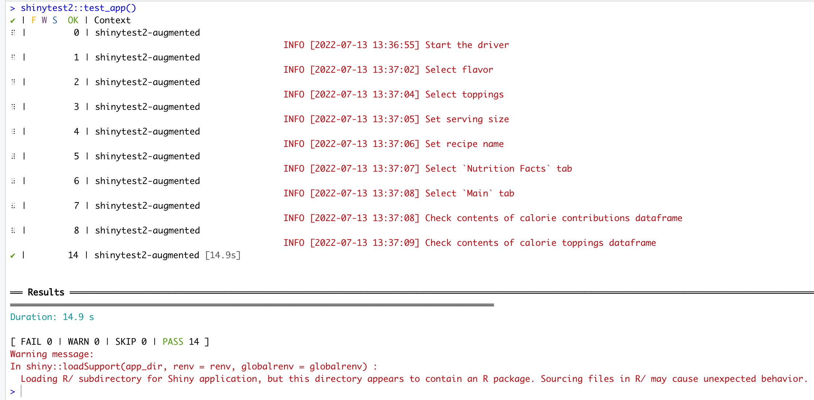

# automated_shiny_testing_demo

The code shared in this repository demonstrates the automated Shiny testing workflow discussed at the 2022 RStudio Conference on Thursday July 28, 2022 at 3:40 PM EDT. 

Speaker: Sydeaka Watson, https://www.linkedin.com/in/sydeakawatson/

Title: "A Robust Framework for Automated Shiny App Testing"

Session Details: https://sched.co/11ibQ

Abstract: 

For production-grade Shiny applications, regression testing ensures that the application maintains its core functionality as new features are added to the app. With the help of various R and Python tools that programmatically interact with the UI and examine UI outputs, regression test logic can be represented programmatically and can run as often as needed. This gives the development team an opportunity to catch and fix bugs before they are pushed to production.

In this talk, I will introduce a framework for automated testing of Shiny applications both (1) during the development phase and (2) after the app is deployed. I will share a demo Shiny app along with relevant shinytest and Selenium code.

# Prerequisites

* Install the RStudio IDE.
  * https://www.rstudio.com/products/rstudio/download/
* Install R. 
  * NOTE: I used R version 4.2.0, but it may still work with an earlier version.
  * https://cran.r-project.org/
* Install Docker. 
  * NOTE: Docker is free for open-source, non-commercial projects. Other uses may require a subscription. See Docker website for more information.
  * https://docs.docker.com/get-docker/

# Setup

* Run the `setup.R` script from within RStudio
* Open the Docker application

# Demo

## Running the Shiny app

First, I recommend that you run the Shiny app locally to ensure that all packages and dependencies were installed correctly.

To run the app, open the `app.R` file in the project's root directory in the RStudio IDE. In the upper right corner, click the Run App button. 

A window should pop up. In this window, you should see the front page of the demo Ice Cream App.

## Deploying the Shiny app

The following link contains instructions for deploying your Shiny app. The first option explains how you can host your Shiny app on the free 
Shinyapps.io service. Usage is limited to 25 hours per month, but this should be plenty for demo purposes. To cut down on usage, I recommend that you put your application to sleep when you aren't running the demo.

Link: https://shiny.rstudio.com/deploy/

## Running the `shinytest2` demo

The `shinytest2` test files are located in the `.../tests/testthat` folder. They are R files with names that include the `test-` prefix. There are 2 options for running the test.

### Option 1: Button Click in the User Interface

Open one of the test R scripts in the RStudio IDE. In the upper right corner, click the "Run Tests" Button.

Results will be displayed in the Build Pane.

If you use this method, you would have to run the tests separately for all test scripts.

### Option 2: Command line

In the R Console, run the following command: `shinytest2::test_app()`. This will automatically run all R scripts in the  `.../tests/testthat` folder whose names include the `test-` prefix, so there is no need to run the tests separately as in the previous option.

Results will be displayed in the R console.

## Running the `Selenium` demo

